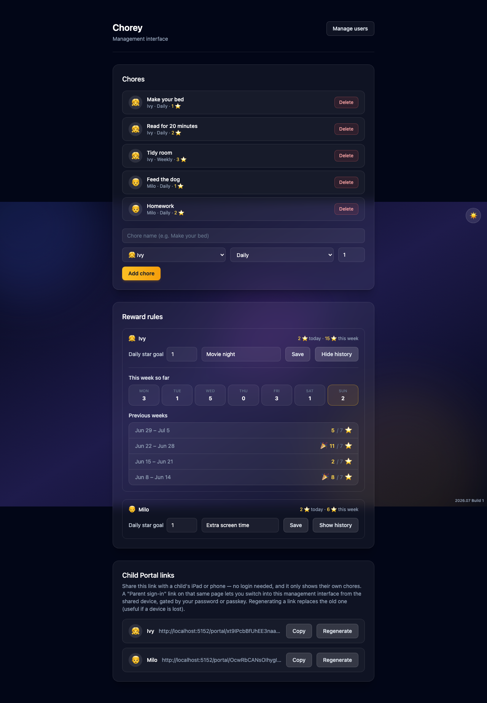
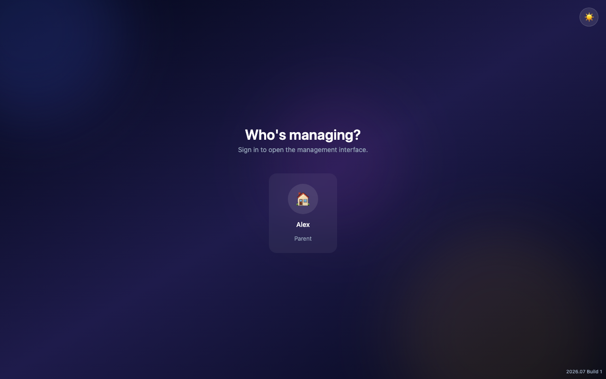
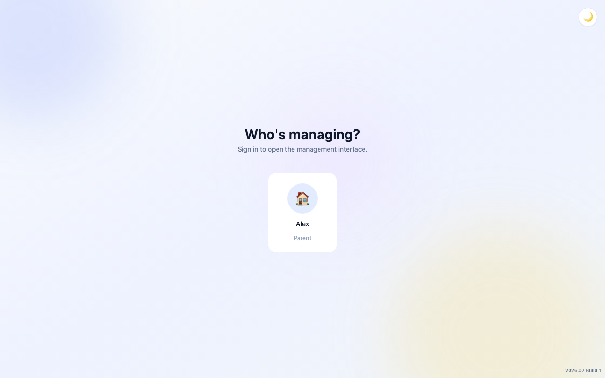
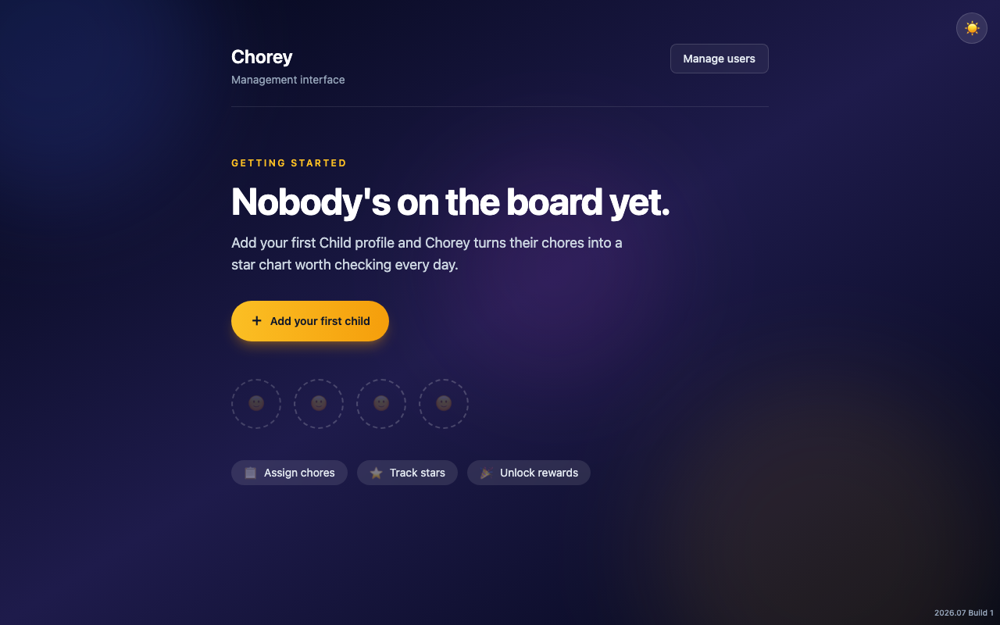
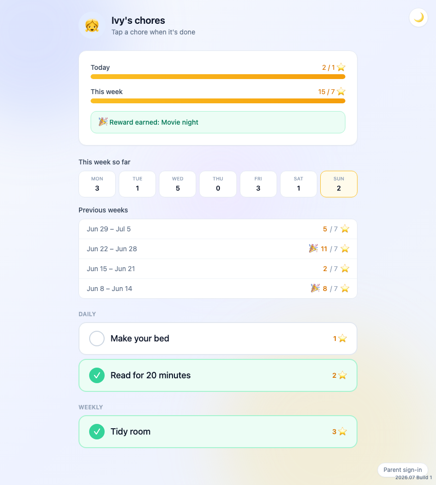
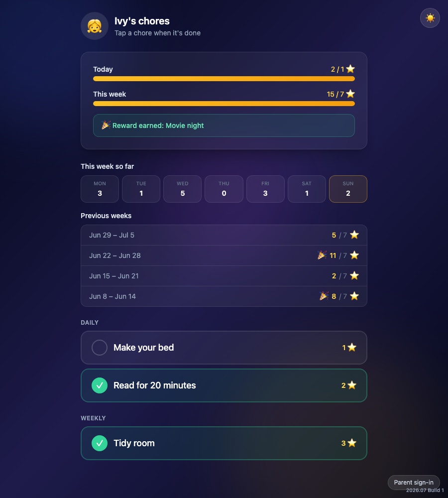
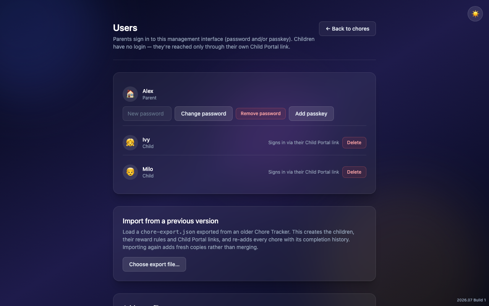

# Chorey

<p align="center">
  
</p>

A self-hosted, single-purpose star-chart chore tracker for a household. It has
two distinct surfaces:

- **Management interface** (`/app`) — Parent-only. Sign in, create chores
  (name, assignee, frequency, star value), delete them, manage Parent/Child
  profiles, set per-child reward rules, and generate Child Portal links.
  Nothing here is reachable without a Parent session.
- **Child Portal** (`/portal/:token`) — a no-login, per-child URL meant to
  live on a shared family tablet or a kid's phone. It shows only that child's
  chores; tapping one completes it immediately (no approval step). A small
  "Parent sign-in" link reveals the Parent picker, which supports both
  password and **passkey** login, so a parent can switch into the management
  interface from the shared device.

Each chore is **daily**, **weekly**, or **monthly** — it can only be completed
again once the current period rolls over. Both surfaces show a Monday–Sunday
day strip for the current week and a summary of past completed weeks (total
stars and whether the reward threshold was hit) — 4 weeks by default, and how
many is a household setting.

Day/week boundaries respect a configurable household timezone (defaults to
UTC), and a completed week's reward threshold is frozen to whatever the goal
was at the time — changing a child's daily goal only affects the current week
and weeks going forward, never rewrites history. Both are set from **Manage
users → Household settings**.

The whole app has both a light and a dark theme, switchable from a toggle in
the top-right corner — dark is the default.

See **[DESIGN.md](DESIGN.md)** for the full design reference: data model,
business logic (period keys, week math, the weekly-history algorithm), the API
reference, and the frontend component contracts.

## Screenshots

**Sign-in — "Who's managing?"**, in both themes:

<p align="center">
  
  
</p>

**Getting started** — the empty-state hero shown before any Child profile exists:

<p align="center">
  
</p>

**Management interface** — chores, reward rules with expandable weekly
history, and Child Portal links:

<p align="center">
  
</p>

**Child Portal** — the no-login view a kid taps through on a shared tablet,
with today/this-week progress, a 7-day strip, and reward status:

<p align="center">
  
  
</p>

**Users** — profile management, passkeys, and importing a `chore-export.json`
from a previous version:

<p align="center">
  
</p>

## Tech stack

- **Backend**: Node.js + TypeScript, Express 4, `better-sqlite3` (WAL mode),
  `zod`, `bcryptjs`, `@simplewebauthn/server` (passkeys), `nanoid`,
  `cookie-parser`, `express-rate-limit`.
- **Frontend**: React 18 + Vite + TypeScript, `react-router-dom` v6,
  Tailwind CSS v3 (class-based dark mode).
- **Packaging**: a single Docker image — Express serves the built React bundle
  as static files and the API from the same origin, running as a non-root
  user.

## Run with Docker

The app listens on **port 5152** and stores its SQLite database in a `data/`
volume.

```bash
docker compose up -d --build     # build and start
docker compose logs -f           # follow logs
docker compose down              # stop
```

Then open <http://localhost:5152> — first run drops you into the setup wizard
to create the initial Parent account.

### Configuration

Copy `.env.example` to `.env` (next to `docker-compose.yml`) and adjust:

| Variable         | Default                   | Notes                                                         |
| ---------------- | ------------------------- | ------------------------------------------------------------- |
| `PORT`           | `5152`                    | Port the server listens on (and the published container port).|
| `SESSION_SECRET` | `change-me-in-production` | **Set a real one** — e.g. `openssl rand -hex 32`.             |
| `RP_ID`          | `localhost`               | WebAuthn relying-party ID (a hostname, no scheme/port).       |
| `RP_NAME`        | `Chorey`                  | Name shown in the passkey prompt.                             |
| `ORIGIN`         | `http://localhost:5152`   | Must match the URL the browser hits, for WebAuthn.            |

**Passkeys** only work in a secure context — `https` on a real domain, or
`http://localhost`. Over a plain `http://<lan-ip>:5152` URL (e.g. a shared
tablet on the LAN) the passkey option is unusable there; the Parent picker
still supports password login as a fallback. To use passkeys off-localhost,
put the app behind HTTPS and set `RP_ID`/`ORIGIN` to that real hostname.

## Local development

`server/` and `client/` are separate npm packages.

```bash
# terminal 1 — API on :5152
cd server && npm install && npm run dev

# terminal 2 — Vite dev server (proxies /api to :5152)
cd client && npm install && npm run dev
```

## Repository layout

```
server/    Express + better-sqlite3 API; also serves the built client in prod
client/    React + Vite single-page app (management interface + Child Portal)
Dockerfile             multi-stage build (client build → server build → runtime)
docker-compose.yml     one service, publishes 5152, mounts ./data
DESIGN.md              full design + API reference
```
